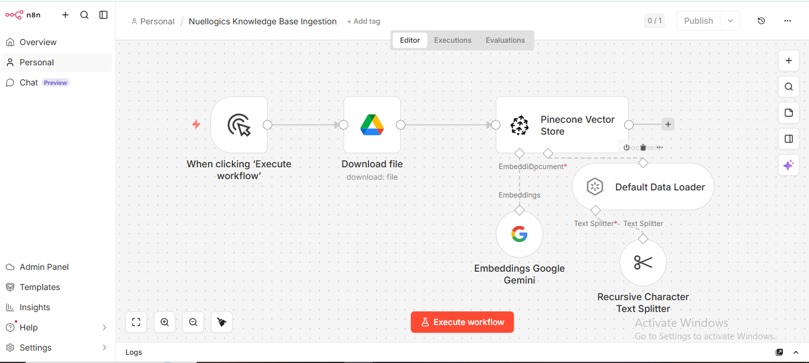

# AI Customer Support Agent

An AI-powered customer support system built with n8n, Gemini, Pinecone, and Postgres memory.

## Features
- RAG-powered retrieval
- Conversational memory
- Automated support responses
- Knowledge base ingestion pipeline
- Telegram delivery interface

## Architecture

