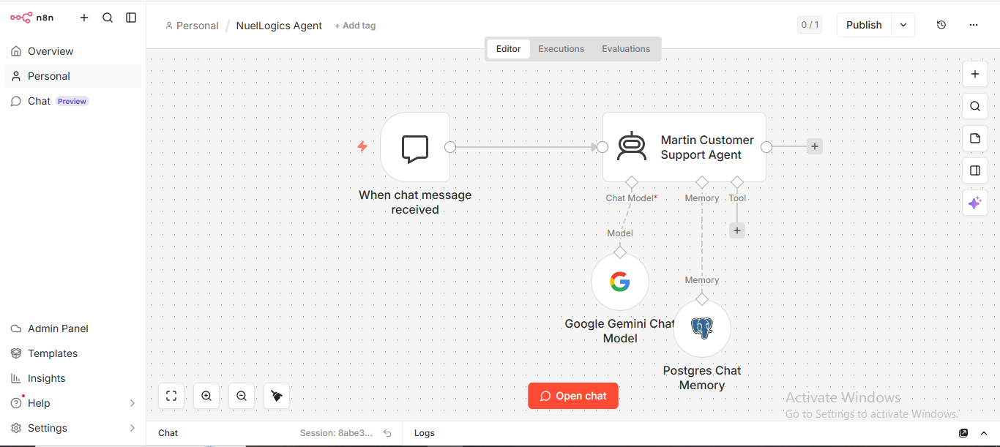

# AI Customer Support Agent (RAG System)

An AI powered customer support system built with n8n, Gemini, Pinecone, and Postgres memory that automates customer responses using business knowledge.

It retrieves relevant information from a knowledge base, maintains conversation context, and responds like a trained support agent instantly.

## What This System Solves

Most businesses struggle with:

- Repetitive customer questions
- Slow response times
- High support workload
- Scaling support without hiring more staff

This system replaces manual support with an AI agent that understands your business.

## How It Works
1. Knowledge Ingestion Pipeline
Google Docs used as knowledge source
Documents are split into chunks
Converted into embeddings using Gemini
Stored in Pinecone vector database

2. AI Support Agent (Runtime)
User sends a message (Telegram)
AI retrieves relevant context from Pinecone
Gemini generates response using retrieved knowledge
Postgres stores conversation memory
Response is returned instantly

## Workflow

## Tech Stack

- n8n (Automation Engine)
- Google Gemini (LLM + Embeddings)
- Pinecone (Vector Database)
- Postgres (Memory Storage)
- Telegram API (User Interface)

## Workflows Included

1. Knowledge Base Ingestion
Converts business documents into vector embeddings
Stores them in Pinecone for retrieval

2. Customer Support Agent
Handles live user conversations
Retrieves context-aware answers
Maintains chat memory per user

## Key Features

- RAG-based retrieval system
- Persistent conversation memory
- Scalable support automation
- Modular workflow design (ingestion vs runtime separation)
- Instant response via messaging interface

## Why This Matters

This is not a chatbot.

It is a support automation system that can:

- Reduce support workload by 60–90%
- Handle repetitive customer queries automatically
- Scale customer communication without hiring

## Current Improvements In Progress

- Confidence scoring for answers
- Smarter retrieval ranking
- Automated knowledge base syncing
- Hallucination reduction safeguards
- Multi-channel support (WhatsApp, Web, Slack)
